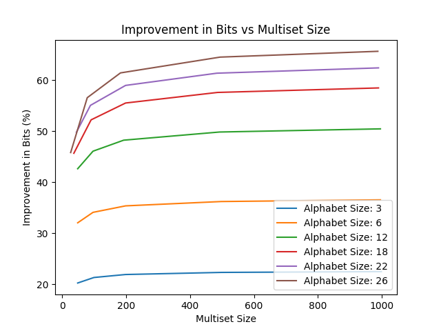

# Implementation of Multiset Compression in SCL

Sumer Kohli
Neelesh Ramachandran
Autumn 2023, EE 274 Final Project

### Introduction

<!-- We learnt about rANS in class and will learn about bits-back coding in HW2. Recent paper and implementation show that it is possible to have a very general method which allows saving bits by not saving the order in the data (utilizing permutation invariance). This uses bits-back coding underneath. This project will involve understanding and re-implementing this method in SCL. -->

In this work, we aim to understand how to utilize bits-back coding to achieve an improved compressionr ratio in a multiset compression setting. A multiset is a generalization of a set that allows for repetition of elements, where the critical information is contained in the elements and not their ordering (equivalently, the frequency map of the elements is what must be preserved.) 

Any standard method to compress a sequence of `n` elements (such as Huffman coding, rANS, or others) will preserve the order of the input elements. By discarding this information, we save bits corresponding to the element ordering. This improved compression technique can be applied in scenarios where the critical information is not contained in the ordering of the elements, such as JSON maps or unordered dictionaries. In this project, we plan to implement a generalized version of this compressor in SCL. Next, we will perform numerous experiments collecting compressor performance and compression ratios on synthetic and real datasets. More specifics on our progress and planned action items is below.

### Literature/Code review

Our primary reference remains the [reference paper](https://arxiv.org/abs/2107.09202). We initially believed that this would contain sufficient detail to convert the mathematical ideas into code, but have since realized that while the analysis the paper provides is extensive regarding theoretical results, many implementation details are actually missing. Certainly, they are included in the code, but our goal is to ensure that we can translate the paper's ideas into code. and provides sufficient depth to fully understand bits-back coding and its application to this problem. A secondary source is the [original paper](https://arxiv.org/abs/1901.04866) on latent variable compression.

We also realized that the implementation of rANS in the SCL is not compatible with the paper's required rANS scheme, since we need an adaptive encode and decode which can take in a set of frequencies. The SCL rANS only initializes the frequencies in the constructor, and does not allow for this adaptive change. This functionality is (by our understanding) critical to maintain a dynamic ANS state as more symbols are compressed. For alternative approaches, we referenced another paper on [Interleaved Entropy Coders](https://arxiv.org/pdf/1402.3392.pdf) from which we are attempting to implement our own SCL adaptive rANS which is compatible with the multiset encode and decode operations as described in the paper.

### Methods
<!-- what do you plan to implement as part of this project? What end result do you expect to achieve and how will you evaluate it qualitatively and quantitatively? -->

As we detailed in the proposal, we plan to implement the multiset compression method described in the paper in a clean, well-documented fashion in the SCL library. To this end, we will implement the encoding and decoding scheme and the accompanying modified BST data structure to support efficient interval insertions and lookups for use therein.

We expect that implementing this compressor will lead to savings in bits and improved compression ratios for specific data that is order-invariant, as compared to compressors that preserve ordering.

The general approach, as well as the structure of the key multiset BST (MSBST), is in the paper, which we now have spent the time to understand in more detail. The implementation of this approach has produced hurdles in the specific assumptions that the code makes, accompanied by our oversight regarding the compressors implemented already in the SCL (the rANS). Our plan remains to develop other practical use-cases for our multiset compression for contexts where the input has some specific feature that we do not require preserving. In a sense, this converts the problem we're working on to a "lossy" one, but not in the same way as conventional lossy compression. We can only tolerate "loss" or distortion along a specific axis (say, input symbol ordering) and our work is to demonstrate how this works (for starters, with order-independent data.)

We have completed a functional implementation of multiset compression in SCL (the bulk of the paper's contribution). We are optimistic that we will complete our proposed deliverables while also benchmarking our performance and compression ratio in detail. We will perform the same compression task using other SCL compressors to demonstrate savings in bits in our approach, and to compare algorithm runtimes. This is elaborated upon below.

### Progress report
<!-- % what have you already finished (please include code link where relevant)? What is the plan for the remaining weeks? -->

#### Progress so far

- [x] Implement MSBST in SCL
  - [x] Forward lookup
  - [x] Reverse lookup
  - [x] Encode
  - [x] Decode
  - [x] Utility: copy, repr, str, etc.
- [x] Create encode/decode functions for multiset compressor
  - [x] Encode function
    - [x] sampling without replacement: decode
    - [x] symbol encode
  - [x] Decode function
    - [x] symbol decode
    - [x] sampling without replacement: encode
- [ ] Create Test Cases
  - [x] Frequency Map test case (end to end)
  - [x] String test case (end to end)
  - [ ] JSON test case
  - [ ] Other order-invariant data compression
  - [ ] Other bits-back general applications?
- [ ] Incorporate Huffman/other comparisons for benchmarking
- [ ] Create plots/figures to show progress
  - [x] Simple end-to-end demo for frequency map, using english characters of various counts
  - [ ] TODO: create a running list of metrics to demonstrate.

As we worked on the items above, we realized that the lack of the adaptive rANS implementation required us to develop that code independently from the multiset compressor. After several unsuccessful approaches, we have a preliminary, simple rANS compressor that will mesh with our multiset compressor implementation. However, it currently uses a uniform prior on the alphabet, which needs to be modified.

#### Plan until Dec. 6th presentation

The core framework of our multiset compressor is in place, and we collected 1 set of sample data to show the kind of experiments we plan to run. We will continue to benchmark our models extensively against other compressors, and will show the theoretical percentage of savings in the same way that the paper does.

We will need to modify our code to fit the dataclass structure of SCL (currently for simplicity during development, we removed the class abstraction layer and have a collection of separate methods).

We will also collect data on wallclock runtimes for our algorithms to see how the encode/decode speeds compare to other SCL compressors. We will not feasibly be able to compare in absolute terms to commercial compressors since SCL itself is not optimized for speed (and we use several utility functions from SCL), but we will make a fair comparison to gauge our algorithm speeds. 

#### Plan until Dec. 15th report

Once the core performance metrics are collected, we will compile them in our report. The report will outline in detail what the multiset compressor does, how it works (including simple demonstrations/examples on sample data), and how our code matches the work presented in the paper. We will also include numerous figures that demonstrate runtime and compression ratios of our algorithms under different settings as compared to other compressors. For flexibility, we will develop synthetic datasets, but will also test using real datasets.

